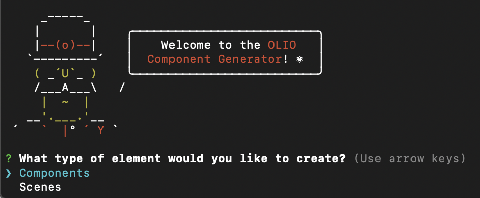

# Boilerplate generator for OLIO react-native components

Quickly create boilerplate components or scenes. Made using the [yeoman](https://yeoman.io/) scaffolding tool.

## Installation instructions

- install yeoman, run `npm i -g yo`
- Download git project and save at the same level as [native repo](https://github.com/OLIOEX/native)
- run `npm install && npm link`

## Usage instructions

- run the command `yo olio`

